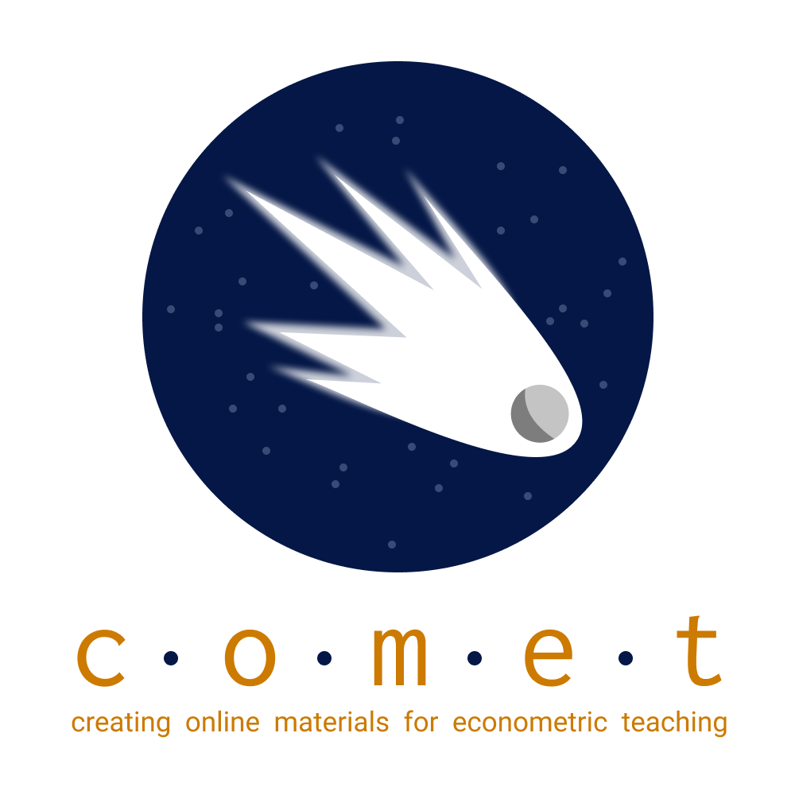

# Welcome to C.O.M.E.T



Welcome to the website for our large TLEF project: COMET.  This site stores our materials to support teaching introductory and intermediate econometrics courses.  This project is funded by the University of British Columbia.  The motivating "pitch" is as follows:

> Currently, all economics students take several courses in the application of economic theory and models to data using statistical methods (econometrics).  Many students struggle to engage with this material, particularly when it comes to practical applications and hands-on experience – putting them at a disadvantage following graduation or in more advanced courses.
This project will address this challenge by creating a collection of hands-on modules designed around best practices for teaching statistics.  These modules, focused on economic questions, models, and data, will use interactive notebook-based technologies (Jupyter) to synthesize analysis, discussion, and conceptualization into a single learning experience – appropriate for either laboratory or flipped classroom instruction.
By adapting proven pedagogical strategies and integrating this material throughout the economics curriculum, students will better master these valuable skills.  This project will also improve accessibility, by lowering costs and hardware requirements, and will produce a library of open educational resources for broader instructional needs.

```{tableofcontents}
```
