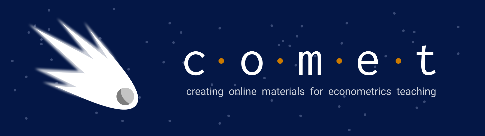

# COMET Team

The COMET project is a true team effort; it has taken input from writers, coders, editors, reviewers, and many more to create COMET.  

> You can contact the COMET team at comet-project@ubc.ca

## Principal Investigators

* Marina Adshade
* Jonathan Graves
* Emrul Hasan

## Research Assistants

<ul>
<li>
<button class="njqaccordion">Colby Chambers - Biography</button>

  
Lorem ipsum...

</li>

<li> Paul Corcuera</li>

<li>Rathin Dharani</li>

<li>
<button class="njqaccordion">Anneke Dresselhuis - Biography</button>

  
Lorem ipsum...

</li>

<li> Colin Grimes</li>
<li> Jonah Heyl</li>
<li> Arshiya Malik</li>
<li> Shiming Wu</li>
<li> Oliver Xu</li>
<li> Valeria Zolla</li>
</ul>

## Other Members and Reviewers

* Paul Schrimpf
* Florian Hoffman
* Shameem Chowdhury

## Special Thanks

* The UBC TLEF team, especially Jeff Miller and Jason Myers.
* The team behind [QuantEcon](https://quantecon.org/), especially Jesse Perla and Peifan Wu for their advice and support.
* The UBC CTLT, Arts ISIT, and LT Hub Teams, for their support with Jupyter and GitLab, especially Stephen Michaud, Nausheen Shafiq, and Michael Ha.
* The UBC DataScience Slack and the Jupyter team, especially Tiffany Timbers, Phil Austin, Firas Moosvi, and the presenters and attendees at JupyterDays 2020
* The staff at the VSE for facilitating events, payments, and space use, especially Maria Smith and Caroline Gatchalian
* Plus many, many, more!