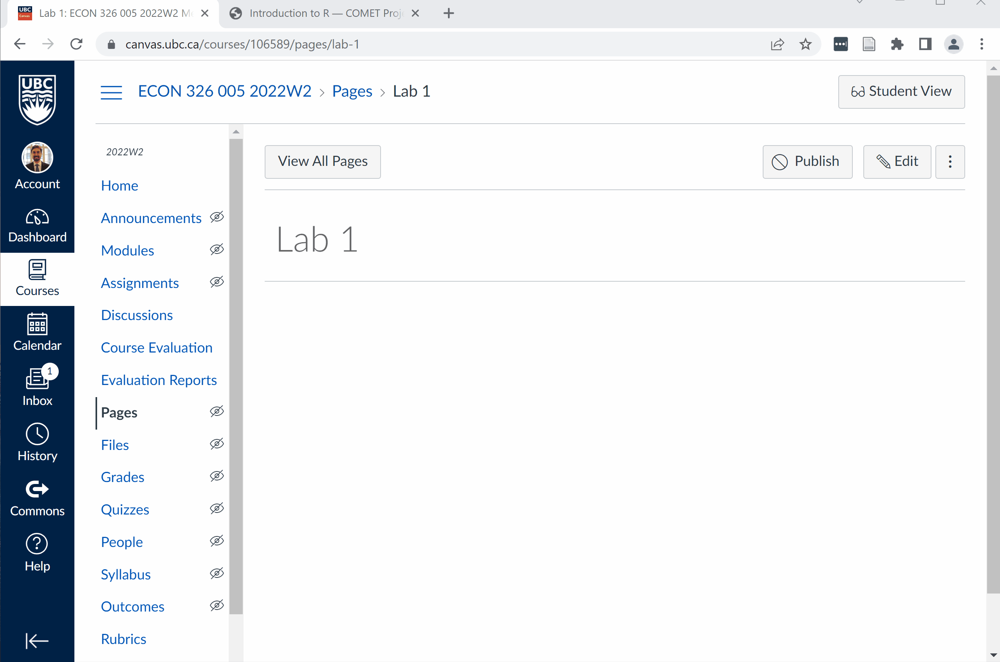

# Using COMET for Teaching

The COMET modules can be used for teaching in a variety of ways.  While we designed most of them to work as a 1-hour (or two 1-hour) labs, they can also be used in a classroom or as a pre-reading/self-study for more advanced students.
* Most of the modules include _self tests_ which are designed to be [formative](https://www.cmu.edu/teaching/assessment/basics/formative-summative.html) in nature.  Some also include short writing exercises.
  - We would not recommend using these for grades, except based on completion.
* Generally, most modules should have someone "animating" them, such as a TA or Instructor, but they can absolutely be read ahead of time to prepare

COMET modules can be launched interactively via a JupyterHub; there is an orientation in the introduction module to Jupyter.
* UBC offers an in-house JupyterHub called [JupyterOpen](open.jupyter.ubc.ca) for which these modules were designed.
* PIMS offers a non-UBC specific JupyterHub called [Syzygy](https://syzygy.ca/) if you are at another institution or JupyterOpen goes down.

## Interactive Modules

All of the Jupyter Notebooks on Canvas can be launched interactively; just select the appropriate hub from the top menu, from the notebook.  They can also be downloaded, for local use.
* The interactive element will redirect you to the JupyterHub of your choice, and then synch the modules over
* This synching process uses [`nbgitpuller`](https://github.com/jupyterhub/nbgitpuller), a JupyterHub extension to perform this operation. 
```{tip}
Occasionally, this can run into problems.  If this occurs, you can try (a) deleting all of the COMET modules from your JupyterHub account, then trying again, or (b) downloading the files manually, then uploading them.  Option (b) will work no matter what.
```
There are also some other options (such as [Thebe](https://thebe.readthedocs.io/en/latest/) which are somewhat experimental at the moment.

## Using with Canvas

To include a module in Canvas, there are two simple ways:

1. Embed it in a Canvas page or assignment
2. Include it as an external link

The advantage of option (1) is that you can include other material around the link (such as instructions).  The advantage of option (2) is that it is easier.

### Option 1: Embed in a Page

You can see a visualization below:



* First, create the page (or assignment) that you want to embed the page in.
* Then, edit the page, and switch the `HTML` edit mode
* Copy the following text into the page:

```
<p><iframe src="PASTE URL HERE" width="800" height="3200" style="overflow: hidden;"></iframe></p>
```
* Replace the `PASTE URL HERE` text with the URL of the COMET page you want
* Optionally edit the `width` and `height` options to change the size of the embed
* Save the page; you should see the embedded page

You can now edit this page normally - for instance, by adding other material.  You could also just add a url instead of an embed normally.  It's up to you!

```{tip}
You can find more information [on this page](https://ucfsd.instructure.com/courses/17245/pages/embedding-a-webpage-in-a-canvas-page).
```

### Option 2: Direct Link

You can also just add a link directly to a Canvas module.

* On the Canvas module, click the (+) to add an item, then select "External URL".
* Enter the URL of the COMET page and customize the name; this is what will show up on Canvas.
* We recommend **not** checking the "load in a new tab" button, but it's up to you.


## Problems and Support

If you run into issues with a COMET module (say, a bug) you can submit an issue to our GitHub directory using the button at the top.

If you need other support, please contact jonathan.graves@ubc.ca

```{important}
If the issue is about a JupyterHub, and not the notebook specifically, we cannot support this.  Contact your hub maintainer for information.
```


